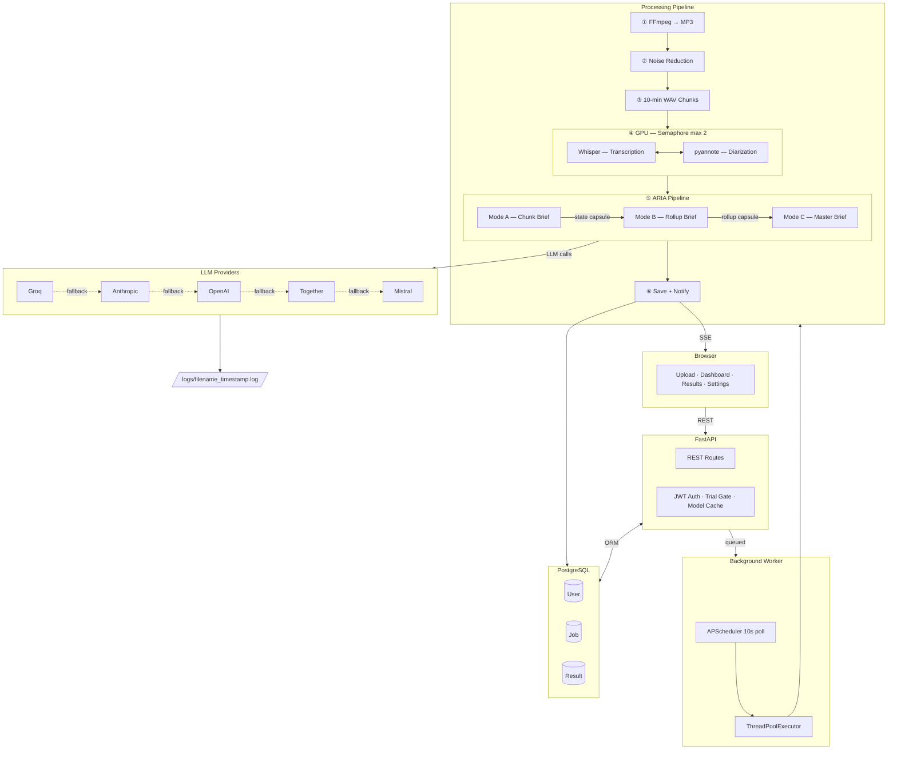

# MeetingMind — Product & Architecture Overview

---

## What It Is

MeetingMind is a self-hosted AI meeting intelligence platform that accepts any audio or video recording — regardless of length — and returns a structured, analyst-quality intelligence report. There is no practical file size or meeting duration limit. A 3-hour board meeting, a 90-minute client call, or a 6-hour conference session are all processed identically, automatically, and without user intervention beyond uploading the file.

---

## Architecture

---

## Key Advantages

| Advantage | Detail |
|-----------|--------|
| **No duration limit** | Hierarchical ARIA pipeline (chunk → rollup → master) means a 6-hour meeting uses the same flow as a 30-minute one — context window never overflows |
| **Noise resilience** | FFmpeg DSP preprocessing (highpass, FFT denoising, non-local means, loudnorm) + tuned Whisper params (`condition_on_previous_text=False`) dramatically improve accuracy on real-world noisy recordings |
| **Speaker-aware transcripts** | pyannote 3.1 diarization labels every segment by speaker, enabling ARIA to attribute decisions and action items to specific people |
| **ARIA state continuity** | A structured state capsule chains chunk-to-chunk, preserving speaker identities, open topics, decisions, and action items across the full session — no context lost at chunk boundaries |
| **Multi-provider LLM** | 5 provider support with automatic fallback; users bring their own keys; model list fetched and cached live from each provider |
| **Complete observability** | Every LLM call logged with exact token counts (prompt + output + total), latency, provider, model, full input/output — per job, per file, timestamped |
| **GPU optimised** | `int8_float16` compute type, semaphore-limited parallel chunk processing, CUDA cache cleared per chunk — designed for consumer GPUs (4GB VRAM RTX 3050) |
| **PDF export** | One-click print-to-PDF with full report expansion, correct print colours, Key Topics cards, and segment briefs — no external library required |
| **Trial + subscription gating** | 3 free uploads enforced at upload time; subscribed users get unlimited processing; both paths tracked in DB |
| **Zero timeout risk** | Jobs are queued in PostgreSQL, picked up by APScheduler every 10 seconds, and processed in a thread pool — the HTTP layer never waits for processing |

---

## Tech Stack

| Layer | Technology |
|-------|-----------|
| API | FastAPI + Uvicorn |
| Database | PostgreSQL + SQLAlchemy ORM |
| Auth | JWT (HS256, 24h expiry) + bcrypt |
| Scheduler | APScheduler (BackgroundScheduler, 10s interval) |
| Audio processing | FFmpeg / ffprobe |
| Transcription | faster-whisper (GPU) / openai-whisper (CPU fallback) |
| Diarization | pyannote.audio 3.1 |
| LLM providers | Groq, Anthropic, OpenAI, Together AI, Mistral |
| Frontend | Vanilla JS, HTML5, CSS3 (dark theme, no framework) |
| Deployment | Self-hosted, single-server, env-var configured |

---

## Processing At a Glance — 3-Hour Meeting

| Stage | Operations | LLM Calls |
|-------|-----------|-----------|
| Format + denoise + chunk | 1 FFmpeg convert + 1 denoise + 1 split | 0 |
| Transcription + diarization | 18 chunks × 2 models (parallel, max 2 GPU slots) | 0 |
| ARIA Mode A — Chunk Briefs | 18 sequential calls | 18 |
| ARIA Mode B — Rollup Briefs | 4 batch calls (batch size 5) | 4 |
| ARIA Mode C — Master Brief | S0 summary + full report | 2 |
| **Total** | | **24 LLM calls** |

---

*MeetingMind — Built for long-form meeting intelligence. Self-hosted. Multi-provider. No limits.*
